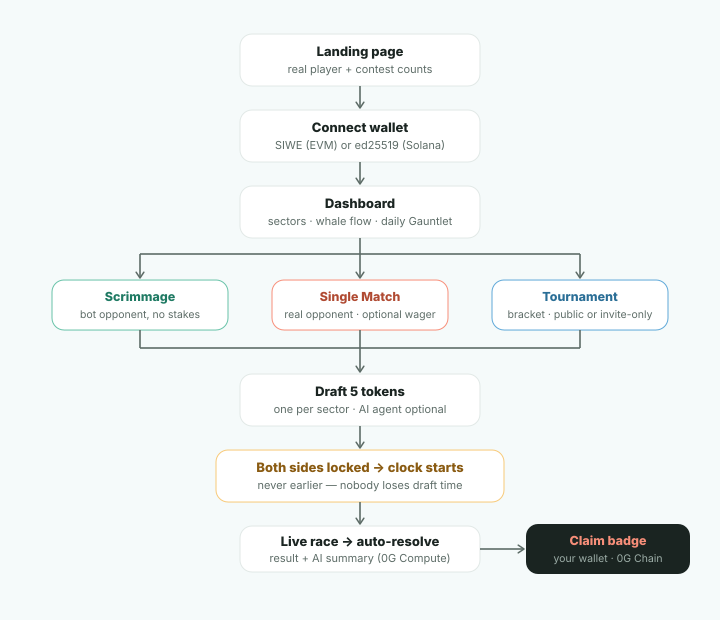
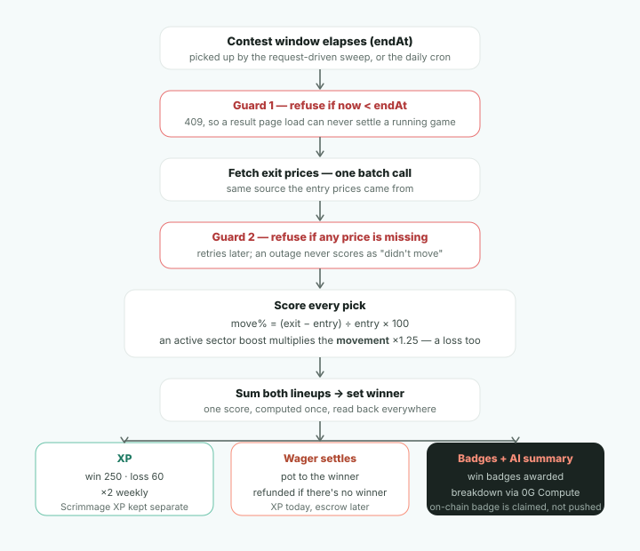
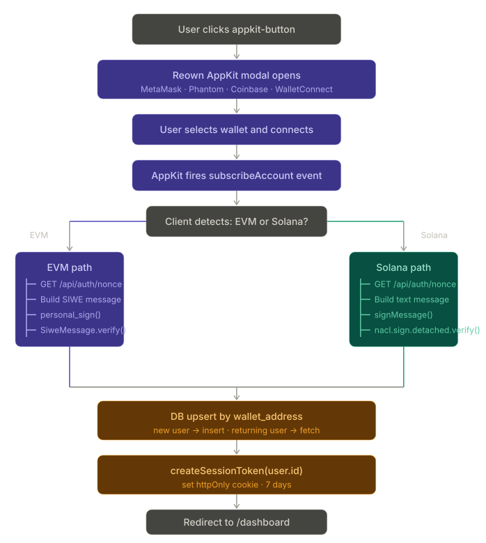
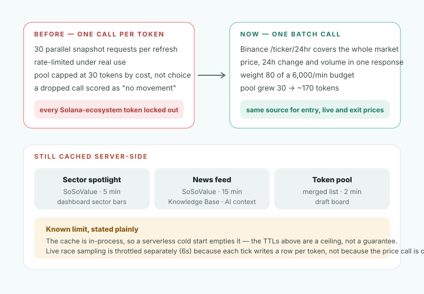

# CoinDraft — Product Requirements Document

### Version 1.0 · SoSoValue Buildathon

> For the current technical architecture and 0G integration detail, see [ARCHITECTURE.md](ARCHITECTURE.md).

**Demo videos:**
- [Coindraft Overview Demo](https://youtu.be/DVWOqzw5of8)
- [CoinDraft Full Demo](https://youtu.be/0E16bxQnfPw)

Live app: [coindrafts.vercel.app](https://coindrafts.vercel.app)
X post: [x.com/cupoftreats/status/2095517444487954774](https://x.com/cupoftreats/status/2095517444487954774)

---

## 1. Executive summary

CoinDraft is a gamified crypto intelligence platform that combines fantasy sports mechanics with real-time market research. Users draft token lineups across crypto sectors, compete head-to-head, and receive AI-powered post-match breakdowns powered by SoSoValue's data infrastructure. The platform teaches crypto market literacy through gameplay — research becomes strategy, strategy becomes sport.

**One-sentence pitch:** Fantasy sports meets crypto research — draft token lineups, compete head-to-head, and get smarter with every match through AI-powered market insights.

---

## 2. Problem statement

### The crypto education problem

Most retail crypto users fall into one of three traps:

- They hold tokens based on social media hype with no research framework
- They want to learn but find research tools intimidating and joyless
- They do research but have no competitive or social outlet to apply it

### The engagement problem

Crypto dashboards, news aggregators, and analytics tools have a fundamental UX problem: they are built for people who already know what they're doing. There is no feedback loop, no reward mechanism, and no reason to come back daily.

### The opportunity

Fantasy sports solved this exact problem for traditional finance — turning passive spectating into active, engaged participation. Nobody has successfully applied this model to crypto with real data infrastructure behind it. CoinDraft fills that gap.

---

## 3. Solution

A three-layer platform:

**Intelligence layer** — Sector Wars (live sector performance) and Whale Watch (ETF institutional flow alerts) give users market context before they draft. Powered by SoSoValue API.

**Learn layer** — The Gauntlet (daily market challenges based on real data) and an AI Mentor teach market literacy through doing, not reading. Completing challenges earns draft boosts.

**Play layer** — Fantasy-style draft contests. Pick 5 tokens across L1, L2, Meme, DeFi, and Wildcard slots. Compete head-to-head. Score on real price performance. Get an AI breakdown after every match explaining why each token moved using SoSoValue research feeds.

The key mechanic: **knowledge earned in the learn layer gives a visible edge in the play layer.** Research is not optional decoration — it is the cheat code.

---

## 4. Target users

### Primary — Casual crypto curious

People who follow crypto on social media, hold a few tokens, but have no research framework. Fantasy sports is a format they already understand. CoinDraft gives them a way into crypto that feels familiar and fun.

- **Pain point:** Too much noise, no clear way to learn, research feels like homework
- **Job to be done:** Feel smart and competitive about crypto without being overwhelmed
- **Acquisition:** Crypto Twitter, fantasy sports crossover communities, TikTok/YouTube finance

### Secondary — Active retail trader

Someone who tracks sectors, reads news, and has market opinions. They want a competitive outlet to prove their edge and a social layer around their research.

- **Pain point:** Doing the research alone with no reward for being right
- **Job to be done:** Validate their thesis, compete, and build a track record
- **Acquisition:** Crypto Reddit, CT (Crypto Twitter), Discord trading communities

### Tertiary — Complete beginner

Someone who wants to get into crypto but finds it overwhelming. The Gauntlet and AI Mentor give them a structured, low-stakes entry point.

- **Pain point:** Every platform assumes prior knowledge
- **Job to be done:** Learn by doing, with real market feedback and no financial risk upfront
- **Acquisition:** Web3 onboarding communities, university groups, fintech apps

---

## 5. Market fit

### Why now

- Bitcoin spot ETFs launched in January 2024 — institutional crypto is now mainstream news
- Fantasy sports market is $11B+ globally and growing — the format is proven at scale
- Crypto retail participation is at all-time highs but education infrastructure lags far behind
- SoSoValue's API provides the data infrastructure that makes real-time gamification possible
- SoDEX launched March 2026 — a fresh ecosystem to build on with early-mover advantage

### Competitive landscape

| Product             | Category          | Gap CoinDraft fills                  |
| ------------------- | ----------------- | ------------------------------------ |
| Polymarket          | Prediction market | Binary yes/no only, no learning loop |
| Metaculus           | Forecasting       | No crypto focus, no fantasy mechanic |
| CoinMarketCap       | Data dashboard    | Passive — no engagement or gameplay  |
| Zapper              | Portfolio tracker | No competitive or social layer       |
| Fantasy sports apps | Gaming            | No crypto data, no market education  |

### Unfair advantages

- SoSoValue API gives access to 16 sector classifications, ETF institutional flow data, and AI-curated research feeds — the data layer most competitors would have to build from scratch
- Fantasy sports format is a globally understood mechanic — zero learning curve for the game itself
- Post-match AI breakdown (Groq + SoSoValue news) is a feature no existing prediction game offers
- SoDEX integration path means real-money prize pools are a clear Wave 3 product evolution

---

## 6. Product goals

What's actually built and live, not a roadmap — see [Status](#status--whats-done-whats-left) below for what's still open.

- Working head-to-head draft contest, end to end — real matchmaking, live race, automatic resolution.
- SoSoValue API integrated across 5 endpoints, cached (see [SoSoValue API integration](#9-sosovalue-api-integration) below).
- Sector Wars and Whale Flow live on the dashboard.
- AI-generated post-match breakdown, grounded in real match data.
- Live deployment on Vercel — [coindrafts.vercel.app](https://coindrafts.vercel.app).
- Scrimmage mode — draft against a bot opponent, isolated from real rank/win-rate/badges.
- Leagues — create, join, browse standings.
- Daily Gauntlet challenges with an XP → sector-boost mechanic.
- Both daily and weekly contest formats, weekly carrying a real XP multiplier.
- AI Mentor — conversational, grounded in live sector/token/news data.
- Knowledge Base — curated news plus an AI-generated Word of the Day, archived on 0G Storage.
- On-chain achievement badges — soulbound ERC-721s on 0G Chain, claimed by the player from their own wallet, live on mainnet. See [Mainnet Deployment](#mainnet-deployment).

---

## 7. Tech stack

| Layer      | Choice                                          | Notes                             |
| ---------- | ----------------------------------------------- | --------------------------------- |
| Framework  | SvelteKit + TypeScript                          | SSR + API routes in one repo      |
| Styling    | Tailwind CSS                                    | Utility-first                     |
| Database   | Postgres (Supabase)                             | Migrated off Neon after repeated compute-quota exhaustion |
| ORM        | Drizzle ORM                                     | Type-safe, lightweight            |
| Auth       | Reown AppKit (EVM + Solana)                     | SIWE + ed25519 wallet signature   |
| Cache      | In-memory Map (Wave 1) → Upstash Redis (Wave 2) |                                   |
| AI         | **0G Compute Router** (testnet), Groq fallback  | Mentor, breakdown, Draft Agent, Gauntlet — see below |
| Data       | SoSoValue API + Binance batch pricing           | Tokens, sectors, ETF, news, live prices |
| Execution  | SoDEX API (Wave 2+)                             | On-chain price feeds, prize pools |
| Deployment | Vercel + adapter-vercel                         | One-click CI/CD                   |

### 0G Integration

**All three of 0G Compute, Storage and Chain are live on mainnet, not testnet or "wired up and pending."** See [Mainnet Deployment](#mainnet-deployment) below for every real address, transaction hash and independently-verified link.

The AI backend is pluggable (`src/lib/server/aiCompute.ts`) — with `USE_0G_COMPUTE=true`, every AI call routes through the **0G Compute Router** instead of Groq, using an identical OpenAI-shaped request so no call site needs to know which backend answered. Four features run on it:

- **AI Mentor** — live chat grounded in real-time sector/token/news data.
- **Post-match AI breakdown** — a short analysis of what drove the result.
- **AI Draft Agent** — picks tokens on request; every use logs a receipt (provider address, request id, billing) shown in the UI as "✓ verified on 0G."
- **Daily Gauntlet quiz + Word of the Day** — questions generated fresh from a shared, batch-generated vocabulary pool instead of a static bank. The two features draw from the same pool but are guarded against ever showing the same term on the same day (`gauntlet.ts` and `term-of-day.ts` each check what the other has already picked before choosing).

**0G Storage** permanently records that AI-generated vocabulary knowledge base — real uploads, replicated across multiple storage nodes, downloaded back with merkle-proof verification before being trusted.

**0G Chain** hosts `CoinDraftAchievements` — a soulbound (non-transferable), claim-based ERC-721 contract. Badges are never pushed to a player: the backend signs a voucher off-chain, and the player submits the claim transaction themselves, from their own wallet, paying their own gas — the on-chain activity is genuinely player-initiated.

Network selection (testnet vs. mainnet) is automatic and never manual — `src/lib/server/zgNetwork.ts` and `src/lib/evmWallet.ts` key off whether the app is running under `vite dev` or an actual build, so local development always talks to testnet and a deployed instance always talks to mainnet.

---

## Mainnet Deployment

Live app: **[coindrafts.vercel.app](https://coindrafts.vercel.app)**

Everything below is independently verified — read back directly from the chain, the storage indexer, or a real authenticated request against the live app — not just trusted from a deploy script's own printed output.

### 0G Chain — chain ID 16661

`CoinDraftAchievements` — soulbound, claim-based ERC-721 achievement badges.

| | |
| --- | --- |
| Contract | [`0x4d1651189e5ba8da437fdd6a689011904d742caa`](https://chainscan.0g.ai/address/0x4d1651189e5ba8da437fdd6a689011904d742caa) |
| RPC | `https://evmrpc.0g.ai` |
| Explorer | [chainscan.0g.ai](https://chainscan.0g.ai) |

Bootstrapped with all 9 achievement types **seeded with their metadata URIs already set** in the same transactions — no window where a claimed badge would resolve to empty metadata (`contracts/scripts/bootstrap-achievements.ts`): First Blood, Scrimmage Starter, Sharp Shooter, Know-It-All, On Fire, Unstoppable, Veteran, Champion, League Founder. Voucher signer authorised. Verified by pulling a real claim voucher from the live app and confirming it points at this exact contract address.

### 0G Storage

Permanent record of the AI-generated crypto vocabulary knowledge base that powers the Gauntlet quiz and Word of the Day.

| | |
| --- | --- |
| Indexer | `https://indexer-storage-turbo.0g.ai` |
| Root hash | `0x2c394d85db6f38e8eade1d00c81e3eb22fdeb7bf9a474bc07c05891fae277bca` |
| Transaction | [`0x66a0c36a09e130886e72f0311341a2153bf841e552172627c9abee0774d6f13d`](https://chainscan.0g.ai/tx/0x66a0c36a09e130886e72f0311341a2153bf841e552172627c9abee0774d6f13d) |
| Storage explorer | [storagescan.0g.ai/submission/212233](https://storagescan.0g.ai/submission/212233) |
| Contents | 101 real, AI-generated vocabulary terms (txSeq 212233) |

Verified replicated across 3 independent storage nodes and downloaded back with merkle-proof verification (`indexer.download(root, path, true)`) — content confirmed intact, not just "upload returned success."

### 0G Compute

| | |
| --- | --- |
| Router | `https://router-api.0g.ai/v1` |
| Model | `qwen3.8-flash` |

Model choice is evidence-based: tested against the app's own vocab-quiz validation rules (4 distinct options, ≥6 words each, correct answer present, definition must not just restate the term) against every mainnet-catalogue candidate worth considering — `qwen3.8-flash` passed cleanly on every item; `deepseek-v4-flash` ran verbose and truncated before finishing valid JSON; `qwen3-vl-30b` is a vision-language model, not a fit for this text task.

---

## Status — what's done, what's left

### Done

- **Core draft/contest loop** — draft 5 tokens across L1, L2, DeFi, Meme and Wildcard, head-to-head matches, live race chart, resolution scored against a live batch price fetch.
- **Real matchmaking** (not just a bot), plus a Scrimmage practice mode against bots.
- **Multiplayer lobbies and bracket tournaments.**
- **Daily Gauntlet quiz + Word of the Day** — AI-generated, drawn from a shared vocabulary pool permanently archived on 0G Storage, with an explicit guard so the two features can never show the same term on the same day.
- **AI Mentor, AI Draft Agent, post-match AI breakdown** — all on 0G Compute (mainnet), with a Groq fallback. The Draft Agent logs a verifiable receipt (provider, request id, billing) for every pick.
- **On-chain achievement badges** — 9 soulbound ERC-721 types, real artwork, claimed by the player from their own wallet (never pushed), live on 0G Chain mainnet. See [Mainnet Deployment](#mainnet-deployment).
- **Wallet auth** for both EVM (SIWE) and Solana (ed25519 signature), leagues, leaderboards, XP/streak progression.
- **Wager mechanic** — tier-matched, blind commit, settles at the lower of the two commits so raising never costs more than you choose. Currently settles in XP, not real funds — see below.

### Left

Full detail, including exactly what went wrong on prior attempts and what to reuse, lives in [`docs-project/whats-next.md`](docs-project/whats-next.md). Condensed:

- **Demo video** — not recorded yet; everything it needs to show already works.
- **Real-money wager settlement** — needs an escrow decision (on-chain / custodial / third-party) before it can be built; currently XP-only.
- **Gasless transactions** — researched (EIP-2771 meta-transactions look like the right fit), not built. Would remove the "need $0G before you can do anything" friction for a new player.
- **Wallet-signed 18+ age confirmation** — the wager age-check is currently a self-reported checkbox. A wallet-signed version was built and reverted after two real bugs surfaced (documented in detail for whoever rebuilds it).
- **Perks/boosts progression** (Captain, Shield, Free Hit) — designed to hang off the achievement system, not started.
- **Non-EVM achievement claiming** — a Solana-signed-in player can't claim a badge yet; 0G Chain is EVM-only and no bridge exists.
- A few smaller open items (tournament creation UX, tournament listing page visual pass, confirming 0G Chain renders in every wallet's own network picker) — see the file above.

---

## 8. Database schema

```
users
  id               uuid PK
  wallet_address   text UNIQUE    ← primary identity (no email/password)
  chain_type       text           ← 'evm' | 'solana'
  username         text UNIQUE
  xp_total         integer
  streak           integer
  created_at       timestamp

contests
  id               uuid PK
  user_a_id        uuid → users
  user_b_id        uuid → users
  type             text           ← 'daily' | 'weekly'
  status           text           ← 'open' | 'live' | 'resolved'
  start_at         timestamp
  end_at           timestamp
  winner_id        uuid → users

lineups
  id               uuid PK
  contest_id       uuid → contests
  user_id          uuid → users
  locked           boolean
  final_score      numeric
  breakdown        text           ← pre-generated AI text

lineup_picks
  id               uuid PK
  lineup_id        uuid → lineups
  token_symbol     text           ← 'SOL', 'PEPE'
  token_name       text
  sector           text           ← 'L1'|'L2'|'Meme'|'DeFi'|'Wildcard'
  currency_id      text           ← SoSoValue currency_id
  entry_price      numeric        ← price at lock time
  exit_price       numeric        ← price at resolution
  pct_change       numeric        ← ((exit-entry)/entry)*100
  score            numeric        ← weighted score
```

---

## 9. SoSoValue API integration

| Endpoint                               | Used for                           | Cache TTL |
| -------------------------------------- | ---------------------------------- | --------- |
| `GET /currencies`                      | Draft token pool                   | 24h       |
| `GET /currencies/{id}/market-snapshot` | Live scoring (30s update freq)     | 60s       |
| `GET /currencies/sector-spotlight`     | Sector Wars dashboard              | 5min      |
| `GET /etfs/summary-history`            | Whale Watch streak detection       | 5min      |
| `GET /news/featured`                   | AI breakdown context, Research Hub | 15min     |

**Rate limit:** 20 req/min, 100,000/month. All calls server-side only via SvelteKit `+server.ts` routes. In-memory cache prevents redundant calls. Peak usage estimated ~0.65 req/min — well within limits.

---

## 10. Scoring system

```
Pick score  = (% price change × 0.8) + (volume bonus × 0.1) + (sector momentum × 0.1)
Volume bonus     = 1 if volume/market_cap > 15%, else 0
Sector momentum  = 1 if sector is top 3 weekly performers, else 0

Lineup score = sum of 5 pick scores
Winner       = player with higher lineup score
```

---

## 11. System architecture

A player's wallet talks to a **client-rendered SvelteKit SPA** (it holds no state of its own), which talks to **API routes** (also SvelteKit, running on Vercel) for everything — auth, drafting, matchmaking, scoring, settlement. The API layer is the only thing that touches the **Postgres database** and the only thing that calls out to external systems: the **wallet** (via WalletConnect/AppKit, for sign-in and for the achievement-claim transaction), **market data** (SoSoValue + Binance), and all three 0G layers (**Compute** for AI, **Storage** for the permanent knowledge base, **Chain** for achievement badges). The one deliberate exception to "API layer talks to external systems" is the achievement claim itself: the backend only signs a voucher, and the player's own wallet submits the actual transaction directly to 0G Chain — never proxied through the server, so the on-chain activity is genuinely theirs.

Drawn as a proper C4 (c4model.com) container diagram — every box typed, every arrow labelled with intent and protocol:


## 12. User flow

The path from opening the app to finishing a match — sign in, draft, race, resolve, see the result.



## 13. Scoring + resolution flow

What happens the instant a contest's clock runs out: both lineups are scored against a single live batch price fetch (never a per-token burst — a fragile pattern this project hit and fixed twice, for entry pricing and again for exit pricing), a winner is decided, XP and any wager are settled, and the result becomes readable.



## 14. Wallet auth flow

Sign-in for both wallet families this app supports — SIWE for EVM wallets, an ed25519 signature for Solana — verified server-side before a session is issued. No email, no password: the wallet address is the identity.



## 15. Rate limit strategy

How the app stays inside SoSoValue's and Binance's rate limits at real usage — batch calls over per-token bursts, cached at TTLs matched to how fast each thing actually changes.



## Local deployment / reproduction steps

### Prerequisites

- Node.js 18+ and npm
- A Postgres database (Supabase or any standard Postgres — the app auto-detects Neon vs. a plain `pg` connection from the URL)

### 1. Install

```sh
npm install
```

### 2. Configure `.env`

Copy `.env.example` to `.env`. Two tiers of variables — the app **will not start** without the first group; everything in the second is optional and the corresponding feature just quietly disables itself if left blank.

**Required — `npm run dev` fails immediately without these** (read via `$env/static/*`, validated at startup, not just at the point of use):

```sh
DATABASE_URL=                  # Postgres connection string
SESSION_SECRET=                # any long random string — signs session cookies
GROQ_API_KEY=                  # AI backend — get a free key at console.groq.com
SOSOVALUE_API_KEY=
SOSOVALUE_BASE_URL=https://openapi.sosovalue.com/openapi/v1
PUBLIC_REOWN_PROJECT_ID=       # wallet connect — free project at cloud.reown.com
```

**Optional — the app runs fine without any of these; each just turns off its own feature:**

```sh
# 0G Compute — set USE_0G_COMPUTE=true to use this instead of Groq for
# /api/mentor and /api/breakdown. Leave false (or unset) and Groq handles both.
USE_0G_COMPUTE=false
ZG_COMPUTE_API_KEY=            # from pc.testnet.0g.ai
ZG_COMPUTE_BASE_URL=https://router-api-testnet.integratenetwork.work/v1
ZG_COMPUTE_MODEL=qwen2.5-omni

# 0G Storage — permanently records the AI-generated vocab knowledge base.
# Without this, vocab generation still works locally, it just isn't archived.
ZG_STORAGE_PRIVATE_KEY=        # a funded 0G testnet wallet (faucet: faucet.0g.ai)
ZG_STORAGE_RPC_URL=https://evmrpc-testnet.0g.ai
ZG_STORAGE_INDEXER_URL=https://indexer-storage-testnet-turbo.0g.ai

# 0G Chain — CoinDraftAchievements (claim-based badge NFTs). Without this,
# the profile page's achievement-claim section simply doesn't render.
ACHIEVEMENTS_CONTRACT_ADDRESS= # see contracts/ to deploy your own
ACHIEVEMENTS_RPC_URL=https://evmrpc-testnet.0g.ai

# Email (password-reset style notifications) — a Gmail account with an App
# Password, not your normal login password. Skipped silently if unset.
GMAIL_USER=
GMAIL_APP_PASSWORD=

# Only read by Vercel Cron in production — irrelevant for local dev.
CRON_SECRET=
```

Everything above is what `npm run dev` reads (testnet by default). There's also a parallel `_MAINNET`-suffixed variant of every 0G variable (`ZG_COMPUTE_API_KEY_MAINNET`, etc., see `.env` for the full list) — `src/lib/server/zgNetwork.ts` picks between the two automatically based on whether the app is running under `vite dev` or a real build, so **local dev never touches the `_MAINNET` values**; only a deployed instance does. No local setup needed for those.

### 3. Set up the database

```sh
npm run db:push   # applies the schema to your (empty) database
```

### 4. Run it

```sh
npm run dev
```

Open the URL it prints (`localhost:5173` by default). Sign in with any EVM or Solana wallet browser extension — the app creates your user record on first sign-in, nothing to seed manually.

### 5. Verify

```sh
npm run check     # svelte-check — should report 0 errors on a clean checkout
```

_CoinDraft · PRD v1.0 · SoSoValue Buildathon · May 2026_
_Solo builder · SvelteKit + Drizzle + Postgres + 0G Compute + Reown AppKit_

## Building

To create a production version of your app:

```sh
npm run build
```

You can preview the production build with `npm run preview`.

> To deploy your app, you may need to install an [adapter](https://svelte.dev/docs/kit/adapters) for your target environment.
